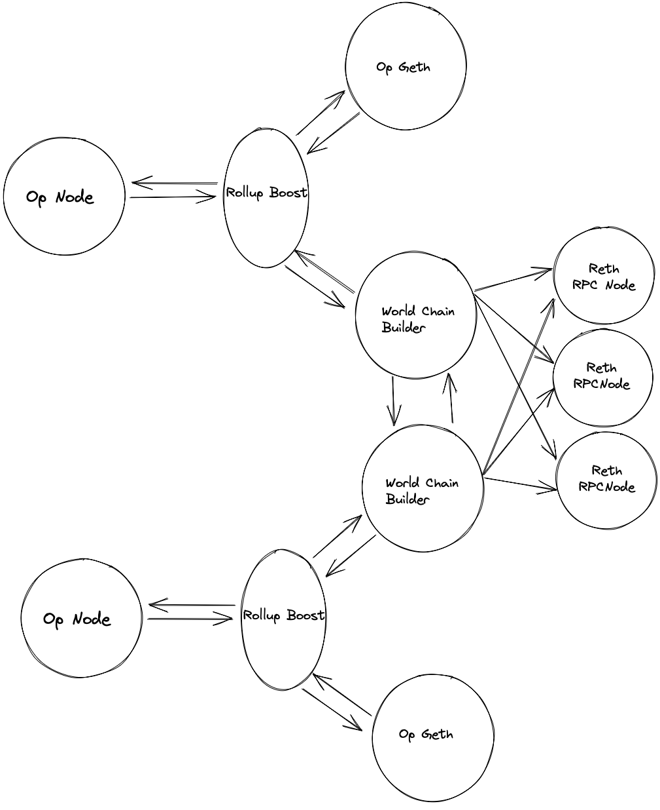

+++
authors = ["Eric Woolsey"]
title = "P2P Flashblocks Propagation"
description = "Web3 native solution for preconf distribution in the OP Stack"
date = 2025-07-29

[taxonomies]
tags = ["Rollup Boost", "OP Stack", "World", "Flashbots"]

[extra]
# banner = "banner.jpeg"
card = "card.jpeg"
toc = true
hot = true

[extra.comments]
host = "mastodon.social"
user = "0xforerunner"
id = "114948839639110660"
+++

> **📚 Source Code**: This article discusses the implementation details of [Rollup-Boost PR #373](https://github.com/flashbots/rollup-boost/pull/373). Check out the link for the latest code and documentation.

# The 200ms Block Party and How the Gossip Flies

Flashblocks are all about speed – blazingly fast **200ms block confirmations**, partial blocks zooming across the network, and rollup nodes chugging quadruple espressos to keep up. If that sounds wild, it is. Flashblocks is a **streaming block construction layer** for rollups that chops each block into bite-sized pieces (called *flashblocks*) and shares them continuously, rather than waiting for the whole block to be built. The result? Near-instant user confirmations, [more efficient MEV](https://oakresearch.io/en/analyses/innovations/flashblocks-towards-ultra-fast-layer2-ev-ms#:~:text=,on%20priority%20fees%2C%20reducing%20the) and potentially even higher overall throughput. Before we dive into the nitty-gritty of the peer-to-peer (P2P) propagation layer that we're building, let's refresh what Flashblocks actually are – and why they're the hottest thing in rollup town.

## Flashblocks in a Flash (Quick Refresher)

Flashblocks were introduced as an extension of Flashbots' Rollup-Boost, aiming to turbo-charge OP Stack based chains (e.g. World’s **World Chain** or Coinbase’s **Base** network) with Solana-esque speed and OP Stack modularity. Instead of the sequencer cranking out a block every couple seconds, Flashblocks splits each block interval into multiple *partial blocks*. For example, a 2-second block might be divided into 10 *flashblocks* of 200ms each. These partial blocks contain chunks of transactions that are executed and streamed out continuously:

- **Near-Instant UX:** Users don’t have to wait a full block time to know if their transaction will made it – they get an early execution confirmation on the [next 200ms flashblock](https://writings.flashbots.net/introducing-rollup-boost#:~:text=Flashblocks%20is%20a%20streaming%20layer,this%20in%20a%20few%20ways).
- **Higher Throughput:** By overlapping execution and networking (and amortizing the expensive state root computation over several chunks), Flashblocks can squeeze in [more gas per second overall](https://writings.flashbots.net/introducing-rollup-boost#:~:text=2,wallet%20and%20front%20end%20integration).
- **Same Trust Model:** All this is done while still running an explicit auction (think MEV bidding) each flashblock interval, and using Trusted Execution Environments (TEEs) to ensure the sequencer behaves. In other words, even though blocks are streaming, the fairness and verifiability are preserved by cryptographic attestation in the TEE.

To visualize, imagine the block builder as an assembly line that doesn’t stop: transactions flow into the TEE-protected builder, which orders and executes them in **200ms batches**, spitting out partial block segments one after another. These segments (flashblocks) are then shipped off to rpc providers continuously. The final block (every 2s or so) is essentially the combination of the last few flashblocks, but by then everyone’s already seen the pieces.

Now that we’re clear on what Flashblocks achieve, let’s talk about the special sauce that enables all this speed in a distributed setting: the Flashblocks **P2P network**. High-speed block streaming could easily devolve into chaos (imagine *multiple chefs* rapidly throwing ingredients into a soup). The P2P mechanism is the coordination layer ensuring all participants know who the *head chef* is at any moment and that every partial block arrives intact, in order, and verified.

## The Flashblocks P2P Network: Gossip at Lightspeed

Flashblocks P2P is essentially a club of peers (block builders and flashblock consumers) engaged in rapid-fire gossip of partial blocks. Unlike a typical P2P network that floods transactions from *any* node, this is a more tight-knit protocol where only authorized block-building nodes can generate new messages. The goals of the Flashblocks P2P layer are straightforward yet ambitious: **propagate partial blocks in ~real-time, coordinate which node is currently building, and do it all without tripping over each other**. Let’s break down how it works, piece by piece (or should we say, flashblock by flashblock).

<!--  -->
{{ image(url="architecture.png", alt="Flashblocks P2P Network Architecture", width=15, height=15, op="fit") }}

### Signed, Sealed, Delivered: Authorized Messages

First, every message flying around in this P2P network is **signed and authorized**. When a builder node creates a new flashblock or a coordination signal, it wraps it in an **`Authorized`** envelope that includes a cryptographic signature involving both the authorizer's (rollup-boost) and builder's signature, a timestamp, and the paylad id.

```rust
pub struct Authorization {
    pub payload_id: PayloadId,
    pub timestamp: u64,
    pub builder_vk: VerifyingKey,
    pub authorizer_sig: Signature,
}

pub struct Authorized {
    pub msg: AuthorizedMsg,
    pub authorization: Authorization,
    pub actor_sig: Signature,
}
```

This ensures a few things:

- **Authenticity:** Only known and authorized builders can produce messages. If some rogue tries to inject a fake partial block, the other peers will drop it because the signature won’t verify against an authorized builder’s public key.
- **Integrity:** The content (whether it’s a piece of block or a control message) can’t be tampered with in transit. If it is, signature verification fails.
- **Freshness:** The timestamp and payload ID is used to prevent replay attacks or using old data. If an old message from a past block turns up, peers will recognize it’s stale and ignore it.

When a message arrives, the receiving peer decodes it and calls `Authorized::verify(...)` using a known **authorizer verifying key** (a network-wide verifier) to confirm the signature is legit. Only then will it process the message. If verification fails – maybe the message is bogus or the peer is trying something fishy – it doesn’t just get ignored; the peer’s reputation is dinged (the protocol has a reputation system to penalize misbehavior). Essentially, the network is saying *“bad peer, no cookies for you”* and if a peer misbehaves too much, it could be dropped.

One quirky check: a node compares the incoming message’s builder ID with its **own** builder key. Why? To detect the scenario where it might be hearing its *own* message echoed back by a peer. If a node sees its own signature coming from someone else, it logs a warning like “received our own message from peer” – an indication that the peer is regurgitating data it got from us. That peer gets flagged for a bad message. This prevents feedback loops and the network equivalent of talking to yourself in a cave of echoes.

### Flashblocks Payload Broadcast: Sharing the Goods

Once a partial block is authenticated and accepted, it needs to spread to all other connected peers **fast**. The Flashblocks P2P protocol implements a broadcast mechanism for this. Think of it like a relay race: one peer gets a new flashblock chunk and immediately passes it along to others, who in turn pass it to others, and so on, almost simultaneously. Under the hood, each `FlashblocksConnection` (representing a connection to one peer) has a stream of outgoing messages (`peer_rx`) that are broadcast from a central hub. When one connection receives a new flashblock, it puts the serialized message into this broadcast stream. All other connections are listening on that stream, and each will pick up the message and send it out to *their* respective peer.

However, there's an important rule: **don’t send the message back to where it came from.** The code checks the origin of each flashblock message using an ID and an index. If the message originally came from peer A, then when peer B and C get it, they should forward it to everyone *except* A. This prevents the obvious looping problem (A → B → C → A → ...). In practice, the code tracks for each connection the latest `payload_id` (an identifier for the current block being built) and which indices of flashblocks it has seen from that peer. If a new message arrives on the broadcast channel for a connection and **either** the payload ID is different (meaning the message is for a new block than the one that peer last sent us) **or** the specific chunk index wasn’t seen from that peer, then it’s fair game – we broadcast it out. If it’s a duplicate of something that peer already sent, we skip sending it back.

This logic ensures that each partial block is broadcast *exactly once per peer*, and no peer gets the same chunk echoed back at them. It’s a bit like a well-choreographed dance: *“Okay, I got part 2 of block #123 from Alice. I’ll forward it to Bob and Carol, but not back to Alice.”* The moment a node enqueues a flashblock for broadcast, essentially **waving the green flag** to send that chunk down the wire to that peer.

#### Duplicate Detection and Spam Control

In such a high-frequency environment, it’s crucial to be vigilant about duplicates – intentional or not. Each connection keeps a `received` bitmap (or vector) indexed by flashblock number, to mark which chunk indices from the current block it has gotten from that peer. If a peer tries to send the same chunk twice (say, chunk #1 of the current block, again), we considers this a mild offense (reputation tagged as *AlreadySeenTransaction*, indicating spammy or redundant behavior). One duplicate won’t get you kicked out, but it’s definitely noted – this prevents a peer from flooding us with repeated data to try and slow us down.

### Who’s cooking? Coordinating with Start/Stop Signals

One of the trickiest parts of Flashblocks P2P is coordinating *who* is currently publishing flashblocks at any given time, specifically when there are multiple block builders (HA Sequencer setups). You can imagine that normally there’s one active builder creating the flashblocks, but what if that node goes down and another needs to take over? We need a way for nodes to politely agree on who’s in charge of block production. Enter the **Control Messages** – these are the signals used to negotiate the role of “active publisher” among peers.

```rust
pub enum AuthorizedMsg {
    FlashblocksPayloadV1(FlashblocksPayloadV1) = 0x00,
    StartPublish(StartPublish) = 0x01,
    StopPublish(StopPublish) = 0x02,
}
```

- **StartPublish:** Picture a peer waving a flag and shouting “I’m going to start building the next block now!” A node sends an `Authorized(StartPublish)` message to indicate it intends to become the block producer for the upcoming block (or current one, if a failover is happening). This message, like the flashblocks, is signed and timestamped (so you can’t maliciously replay an old “I will build” from last year and confuse everyone). When others receive a valid StartPublish, they update their records of **active publishers**.

- **StopPublish:** This is the counterpart signal: “I’m stopping (or finished) my block building.” It indicates the peer is stepping down as an active builder. In practice, a StopPublish is only sent in response to receiving a `StartPublish` message.

These messages allow a kind of leader election or failover coordination. Let’s parse how we handle them:

#### StartPublish: Yielding to a New Builder

If our node is *not currently building a block*, receiving a `StartPublish` from peer X is straightforward – we simply add X to our list of `active_publishers`. Essentially, *“Alright, peer X is now an active builder; noted.”* If X was already on the list, we update their timestamp (they’re still active but refreshing their intent at this moment).

If our node *is currently building* when a StartPublish comes in from someone else, that’s a potential conflict. The code’s strategy here is somewhat selfless (and pragmatic): we **stop our own publishing** to avoid a tug-of-war. Upon seeing a peer’s StartPublish while we are in `Publishing` status, we create a `StopPublish` message *signed by us and using our most recent authorization*. This is our white flag: *“Okay, you be the builder. I’m stepping down.”* Our status switches to `NotPublishing`, and we list the other peer as active publishers.

If our node was in a weird intermediate state – say we were *about to* publish (in a waiting state, maybe we intended to start at the next block but hadn’t yet because someone else was active last block) – and we get a StartPublish from another peer, we choose to **ignore** the request in terms of overriding anything. This is basically *“We’re already in line to publish, and someone else is also signaling to publish – let’s not thrash, we’ll stick to our plan and let the surrounding RAFT consensus (at the next block boundary) sort it out.”* In practice, simultaneous `StartPublish` signals might happen in a double failover scenario (two nodes racing to replace a failed builder). We acknowledge that this race could happen (“double failover” scenario) but choose not to immediately resolve it. Instead we rely on the underlying RAFT consensus algoritm which selects the sequencer leader (and thus flashblocks publisher) to eventually regain consistancy.

#### StopPublish: Stepping Aside Gracefully

When a `StopPublish` message comes in, it means a peer who was an active builder is now out. How we handle it depends on what we were doing:

- If we weren’t publishing (just a passive observer or waiting), we simply remove that peer from our `active_publishers` list. *“Got it, peer Y is no longer building.”* If Y wasn’t in our list (which would be weird, like getting a goodbye from someone who we didn’t know was building), we log a warning about an unknown publisher.

- The interesting case is if we were **waiting to publish** (meaning we want to build the next block but aren’t yet, because another is building). If we then receive a StopPublish from a peer, that means *the current builder has finished*. We handle this as a trigger for us to take over and we remove that builder from the active list. Then we check: is the active publishers list now empty? If **yes**, that means no one else is currently building, so it’s our time to shine – we transition our state to `Publishing`. This implies we will begin building the new block (we had an authorization to do so ready, which we now activate) or continue building atop the previous publishers work (more on this later). If the active list isn’t empty (perhaps another backup builder is still in line or started), we remain in waiting. Essentially, only when the last other active builder steps aside do we step up to build.

This Start/Stop dance ensures a kind of failover safety: if one builder crashes or exits, another can pick up (almost immediately for the next block interval) so the chain keeps running at 200ms pace without missing a beat. All of this is done without a central coordinator (as long as we're not counting op-conductor :p) – it’s purely through P2P signals and local decisions based on them, which is pretty neat from a decentralization perspective. It’s like a group of chefs in a kitchen seamlessly taking turns: if the head chef drops the pan, the next chef in line grabs it and continues cooking the meal, while the rest of the kitchen is instantly aware of the swap.

### Incremental Execution and the Need for Speed

On receiving and validating each flashblock, our node will immediately execute it against its local state, serve rpc requests, and optimitically compute the state root. By the time the final block is assembled, the node has already done most of the work. Continuous execution is one of the big value propositions of Flashblocks : instead of a huge pause-and-process at block boundary, you nibble on the transactions continuously, staying in sync with the head of the chain.

### Reputation and Resilience

Before we wrap up, it’s worth noting the P2P protocol isn’t naive about adversarial conditions. It has a built-in notion of peer reputation (as mentioned earlier). Misbehaviors like sending invalid data, outdated messages, or obvious spam trigger reputation drops. This could eventually lead to disconnecting a bad peer. The code we’ve walked through uses `ReputationChangeKind::BadMessage` for serious offenses (invalid signature, sending our own message back, etc.) and lighter flags like AlreadySeenTransaction for spammy duplicates. The idea is to keep the club small and honest – only authorized builders or well-behaved nodes get to stay in this high-speed gossip network.

### Final Thoughts

P2P Flashblocks propagation is a fascinating blend of high-performance networking and consensus coordination. It’s not every day you see a blockchain protocol where nodes are effectively saying, _“Hey, that's a nice block you have there – let me finish it for you”_ and doing so 5 times a second in perfect harmony. By carefully coordinating who builds when (using Start/Stop signals) and rapidly broadcasting partial block data, Flashblocks achieve a kind of concurrency between block production and block propagation without collapsing into confusion.

For developers, the key takeaways from the P2P mechanism include the importance of robust message validation (signatures and timestamps), efficient broadcast (to not become a bottleneck at high frequency), and state management for incoming data (tracking indices, payload IDs to know what’s what). The protocol shows how trust (via TEEs and sigs) and speed (via P2P streaming) can coexist. It’s a brave new world where OP Stack L2s might routinely have sub-second (or even sub-quarter-second!) confirmation times.

In true World/Flashbots fashion, Flashblocks is pushing the boundaries of what’s possible by rethinking the roles of time and communication in block building. It brings a little bit of Solana’s playbook (fast block propagation) into the OP Stack and the result is a high-wire act of engineering that’s as cool as it is profound – a network of nodes flawlessly coordinating at breakneck speed, all so your trade lands in 0.20 seconds flat. Not quite time-travel, but in the blockchain world, it sure feels close! 
